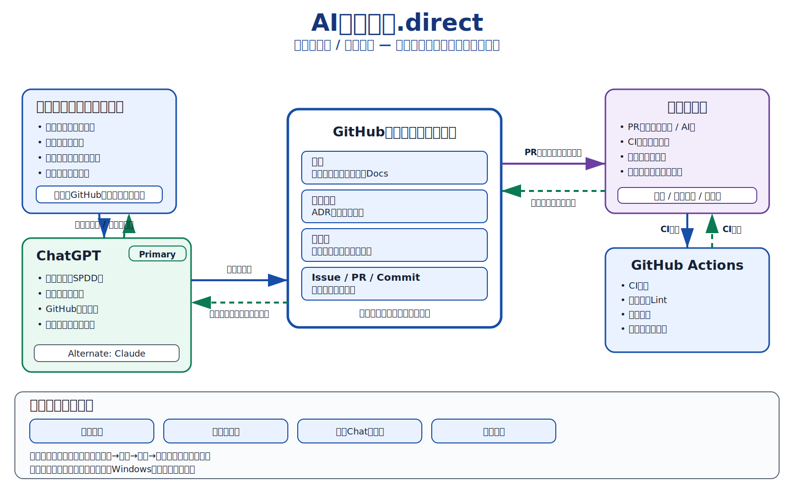
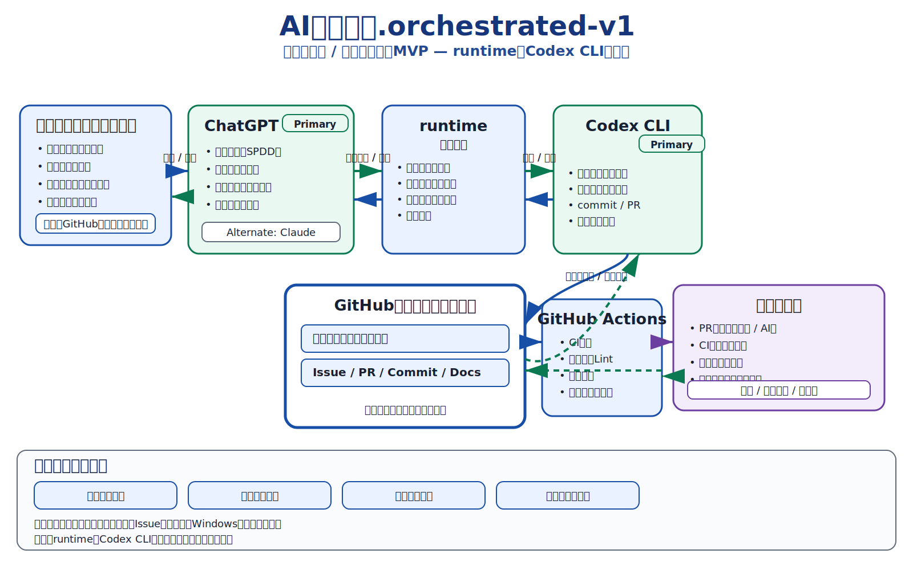
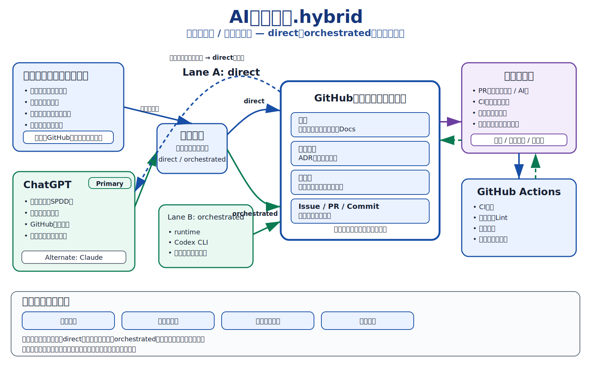
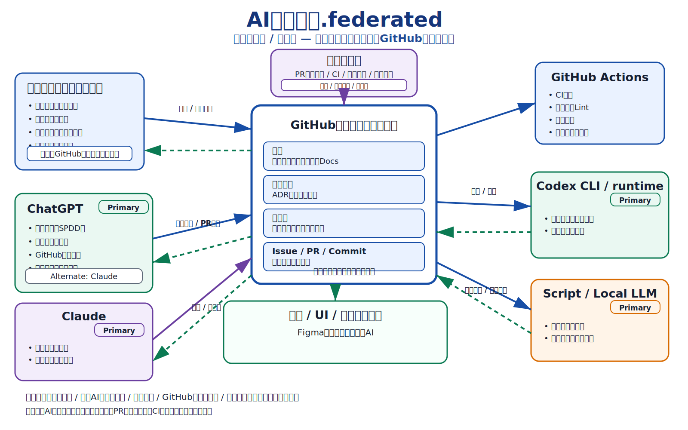

# いきもの研究所 AI協働基盤

## 1. 本書の位置づけ

本書は、いきもの研究所における人間・AI・実行基盤・GitHubの役割分担、正本管理、実行経路および代替経路を定める正本である。

会話、メモリ、Issue、議事録、画像、口頭の合意は、それだけでは正本にならない。本書または本書から参照される正本文書・正本図版へ、Pull Requestを通じて反映され、mainへマージされた内容を現行の運用上の真実とする。

本書は個別のAI製品を恒久的な組織単位として固定するものではない。一方で、交換可能性を理由に日常運用の主担当を曖昧にせず、役割ごとのプライマリーAIまたは主機を明示する。

本書v0.2は、v0.1の基本思想を維持しつつ、次を明確化する。

- AI協働基盤は、上から下へ進む単純な直列工程ではない
- GitHub正本を共通基準面とする、往復型・反復型の協働ネットワークである
- 人間は原則としてGitHubを直接編集せず、AIとの対話を通じて意図、判断、承認を与える
- 品質ゲートは独立した作業者ではなく、PRレビュー、CI、テスト、承認条件の集合である
- 4つの実行形態は、一枚へ過剰に統合せず、モード別の正本図版で表現する

## 2. 正式名称

### 2.1 上位名称

**いきもの研究所 AI協働基盤**

識別子は次のとおりとする。

`ikimono-lab.ai-collaboration`

### 2.2 図の名称

役割、責任、主担当AI、代替AIを示す図を、**AI協働体制図**と呼ぶ。

技術的な接続、実行経路、データの流れ、制御点を示す図を、**AI協働実行構成図**と呼ぶ。

両者は目的が異なるため、原則として一枚の図へ過剰に統合しない。実行形態の説明では、`direct`、`orchestrated-v1`、`hybrid`、`federated`を一枚ずつ独立して図示する。

## 3. AIオーケストレーションとの関係

AIオーケストレーションは、複数のAI・ツールに対する実行順序、割当、状態、再試行、成果物回収など、**実行経路を統制する仕組み**である。

AI協働基盤は、それを包含する上位体系であり、次を扱う。

- GitHub正本による意味と判断の連続性
- 人間とAIの役割・責任
- プライマリーAIと代替AI
- directを含む複数の実行形態
- 品質ゲートと人間承認
- 記憶、履歴、決定記録
- 障害時・利用枠枯渇時の退避経路

したがって、AIオーケストレーションは没ではなく、`AI協働基盤.orchestrated-v1`などに含まれる一つの実行方式である。

> オーケストレーションは処理を束ねる。AI協働基盤は、正本を共通基準として、意味・役割・記憶・判断・処理を束ねる。

## 4. 目的

AI協働基盤の目的は、次の六点である。

1. 人間が価値判断と最終責任を保持したまま、AIへ判断前工程と実行工程を移譲する。
2. 役割と実行主体を分離し、AI、CLI、スクリプト、実行基盤を交換可能にする。
3. 交換可能性を理由に現在の主担当を曖昧にせず、プライマリーAIを可視化する。
4. GitHubを正本・履歴・共同作業の基盤とし、会話依存を減らす。
5. directと自動実行経路を複線化し、特定のAI、利用枠、料金体系、ローカル環境が全体停止の単一障害点になることを防ぐ。
6. 人間とAI、AI同士、正本と成果物の間にある往復・反復・査読・修正の実態を、運用と図解の双方で正しく表現する。

## 5. 基本原則

### 5.1 人間主宰

人間は、次を担う。

- 目的と価値の設定
- 優先順位の決定
- 非言語情報、現場感覚、当事者性の持込み
- 例外の承認
- 正本変更の最終承認
- 成果物の最終判断
- 公開、販売、対外説明に関する責任

AIは判断材料を作り、提案し、実行できるが、組織としての最終責任主体にはならない。

人間は原則としてGitHubを直接編集しない。人間の意図、判断、承認、差戻しは、主にChatGPT等との対話、PRレビュー、承認操作を通じて反映する。緊急時または保守上必要な直接操作を禁止するものではないが、標準体制図では人間をGitHubの編集主体として描かない。

### 5.2 GitHub正本による連続性

GitHubを、次の共通基準面とする。

- 正本
- 決定記録
- 議事録・検討記録
- 変更履歴
- コード
- Issue
- Pull Request
- テスト結果
- 実行記録
- 正本図版

会話履歴やAIメモリは補助記憶であり、正本の代替ではない。

GitHubは単なる保存庫ではない。人間、ChatGPT、Claude、Codex CLI、runtime、スクリプト、GitHub Actionsが、同じ現行仕様、判断履歴、成果物を参照するための共通基準面である。

### 5.3 役割と実行主体の分離

「何を担うか」と「何で実行するか」を分ける。

例として、リポジトリ実装という役割は、ChatGPT、Codex CLI、将来の別AI、決定論的スクリプトのいずれでも実行し得る。ただし、日常の標準経路では主担当を一つ定める。

役割の変更と、実行主体の交代を混同しない。実行主体を交換しても、役割、入力、出力、品質条件、正本との接点は維持する。

### 5.4 プライマリー明示

代替可能であっても、常用する主担当AIをプライマリーとして明示する。

プライマリーとは、次の条件を満たす実行主体をいう。

- 日常的に最初に割り当てる
- 当該役割に必要な文脈、指示、接続を優先的に整備する
- 品質と運用実績を継続的に評価する
- 障害時には代替へ切り替えられる

代替可能性は、すべてのAIが同等であることを意味しない。

### 5.5 往復型・反復型の協働

AI協働基盤は、要件、設計、実装、検査、承認が上から下へ一度だけ流れる単純な工程ではない。

実態は、次のような行きつ戻りつのネットワークである。

- 人間とChatGPTの相談、提案、承認、差戻し
- ChatGPTとGitHubの参照、実装、差分確認、修正
- ChatGPTとClaudeの査読、反証、補足、再統合
- runtime、Codex CLI、GitHubの指示、実行、ログ、再試行
- Pull Request、レビュー、CI、修正、再レビューの反復
- 正本、決定記録、議事録間の昇格と見直し

図解では、この実態を一方向の階層図に押し込めず、双方向矢印、ループ、複線、共通基準面によって表現する。

### 5.6 最小依存経路の保持

高度な自動化経路とは別に、中間依存の少ない直接経路を常に保持する。

単純な構成は低性能版ではなく、故障点が少なく、復旧経路として強い。したがって、directを簡易版、初心者向け、劣化版として扱わない。

### 5.7 費用と利用枠を設計条件に含める

AIの利用枠、共有クォータ、料金体系、追加課金の有無は、技術外の事情ではなくアーキテクチャ上の制約とする。

現行方針では、予期しない追加費用を避けるため、従量課金APIを標準実行経路へ組み込まない。採用する場合は、人間による明示承認と別途の正本変更を必要とする。

### 5.8 正本整合性と異論の両立

実行は正本に従う。一方で、発想、仮説、異論、反例は正本へ早期に吸収せず、検討記録として保持する。

- 議事録は可能性の空間
- 決定記録は選択の理由
- 正本は現在の運用上の真実

正本の一貫性を守りつつ、探索の多様性を失わない。

## 6. 用語

| 用語 | 定義 |
|---|---|
| 役割 | 継続して必要となる責務。特定AIから独立して定義する。 |
| プライマリーAI | 当該役割を日常的に最初に担う主担当AI。 |
| 代替AI | プライマリー停止時、検証時、異論形成時に用いるAI。 |
| 主機 | AI以外を含む、当該役割の標準的な実行主体。 |
| 実行エンジン | コード変更、文書変更、試験、生成などを実際に行うAI、CLI、スクリプト。 |
| 実行統制runtime | タスク受付、状態管理、割当、再試行、ログ回収、成果物回収を担う実行基盤。 |
| 正本 | 現時点で従うべき承認済みの仕様、方針、コード。 |
| 正本図版 | 本文の構造を視覚的に示す、版管理された承認済み図版。 |
| 決定記録 | 採用・不採用の結論、理由、適用範囲、見直し条件を記録したもの。 |
| 議事録 | 検討過程、仮説、異論、未解決事項を含む記録。矛盾を許容する。 |
| 実行形態 | AI、人間、runtime、GitHubをどう接続するかを示す運用モード。 |
| 品質ゲート | PRレビュー、CI、テスト、承認条件、マージ条件からなる品質判定機構。 |
| 共通基準面 | 複数主体が同じ正本、履歴、成果物を参照するためのGitHub上の接点。 |

## 7. 共通構造

### 7.1 人間とAI

人間はChatGPT等へ目的、制約、優先順位、承認を伝える。ChatGPT等は、要求整理、設計、実装、査読結果の統合、GitHub操作を行い、人間へ判断材料と結果を返す。

### 7.2 GitHub

GitHubはすべての実行形態に共通する正本・履歴基盤である。

- main: 現行正本
- branch: 変更候補
- Pull Request: 正本変更の審査単位
- Issue: 作業要求、問題、未解決事項
- commit: 変更履歴
- Docs: 仕様、設計、決定記録、運用記録
- Actions: 機械的検査の実行基盤

### 7.3 品質ゲート

品質ゲートは独立したAIまたは単一サービスではない。次の結果を組み合わせて、マージ可否、条件付き承認、差戻しを判断する。

- 人間またはAIによるPRレビュー
- GitHub ActionsのCI結果
- 関連テスト
- 静的解析、Lint、機密情報検査
- 正本との整合性
- 人間承認

成果物はGitHubから別の箱へ一方向に渡されるのではなく、Pull Requestを中心に、レビュー、CI、修正、再提出、再レビューを反復する。

## 8. 実行形態

### 8.1 `AI協働基盤.direct`

#### 定義

人間がChatGPTと対話し、ChatGPTがGitHubを直接参照・更新して、要件整理、設計統合、コード・文書変更、Issue、branch、Pull Request、レビュー支援、Actions確認を一貫して担う直接協働型である。

#### 標準構成

```text
人間
  ↕ 相談・意図・承認・報告
ChatGPT
  ↕ 参照・実装・差分・履歴・レビュー結果
GitHub
  ↔ Pull Request / 品質ゲート / GitHub Actions
```

人間は標準経路ではGitHubを直接編集しない。

#### プライマリー

- 対話、要件整理、設計統合、GitHub直接操作: ChatGPT
- 正本・履歴: GitHub
- 自動検査: GitHub Actionsおよびリポジトリ内スクリプト
- 独立査読の代替・補助: Claude

#### 強み

- 中間コンポーネントが少ない
- 会話と実装の文脈が分断されにくい
- Codex系共有利用枠に依存しない局面では継続性が高い
- 人間が経路を理解しやすい
- 障害時の切り分けが比較的容易
- 他モード停止時の退避経路になる

#### 弱み

- ローカルWindows環境を直接観測できない
- 長時間無人運転、定期実行、再試行制御は弱い
- 人間の対話セッションへの依存が残る
- 大量の独立Issueを並列処理する統制には向かない

#### 適用

- 仕様策定と実装を連続して行う
- 単一または少数のIssueを扱う
- 人間がレビュー可能である
- GitHub上で作業が完結する
- 自動実行基盤の障害または利用枠枯渇から退避する

`direct`は簡易版ではなく、**最小依存で壊れにくい基幹経路**である。

#### 正本図版



### 8.2 `AI協働基盤.orchestrated-v1`

#### 定義

ChatGPTが要件整理と実行方針を担い、実行統制runtimeがタスクを受け、Codex CLIを実装エンジンとして呼び出し、ローカル作業、状態管理、ログ収集、再試行、成果物回収、GitHubへの反映を行う実行統制型である。

旧称は**連絡将校MVP**とする。旧称は履歴上保持するが、新規の体系説明では`orchestrated-v1`を用いる。

#### 標準構成

```text
人間
  ↕ 相談・承認・報告
ChatGPT
  ↔ 実行依頼・結果・追加指示
実行統制runtime
  ↔ 実行指示・状態・ログ・再試行
Codex CLI / ローカル作業環境
  ↔ 実装・テスト・PR・履歴
GitHub
  ↔ Pull Request / 品質ゲート / GitHub Actions
```

#### プライマリー

- 要件整理、設計統合、実行方針: ChatGPT
- 実行統制: PowerShellベースの現行runtime
- 実装エンジン: Codex CLI
- 正本・履歴: GitHub
- 補助処理: スクリプト、将来のローカルAI

#### 強み

- ローカルWindows環境を扱える
- 状態遷移、再試行、ログ、成果物を統制できる
- 定型Issueの自動処理に向く
- 長時間実行や人間不在時間帯の処理へ拡張できる
- 大量処理と反復修正に向く

#### 弱み

- 現行v1ではCodex CLIが唯一の実装エンジンである
- CodexとWorkの共有利用枠が枯渇すると、実装工程が停止する
- runtime、PowerShell、ローカル環境、Codex CLIの複合障害点を持つ
- UI上の利用量表示や外部サービス仕様の影響を受ける
- runtimeまたはCodex CLIの停止が自動経路の単一障害点になる

#### 適用

- ローカルWindows固有の動作確認が必要
- 定型的なIssueを繰り返し処理する
- 状態管理、再試行、詳細ログが必要
- directでは扱いにくい長時間実行を行う
- 夜間・定型タスクなど、人手削減を優先する

`orchestrated-v1`はdirectの上位版ではない。得意領域が異なる補完経路である。

#### 正本図版



### 8.3 `AI協働基盤.hybrid`

#### 定義

`direct`と`orchestrated-v1`を併設し、タスク特性、障害、利用枠、費用、必要なローカル接続に応じて経路を選択または切り替える複線協働型である。

#### 位置づけ

当面の目標形とする。

#### 標準構成

```text
                 ┌─ direct: ChatGPT ↔ GitHub ───────────┐
人間 ↔ ChatGPT ──┤                                      ├─ Pull Request / 品質ゲート
                 └─ orchestrated: runtime ↔ Codex CLI ↔ GitHub ─┘
```

両レーンはGitHub正本と品質ゲートを共有する。片方の障害、制約、利用枠枯渇時には、他方へ退避する。

#### 要件

- directを常時利用可能な標準経路または退避経路として維持する
- orchestratedの失敗がdirectを巻き込まない
- 同一タスクを二重実行しないため、担当経路と状態を記録する
- どの経路で生成された成果物でも同じPull Requestと品質ゲートを通す
- 人間が経路変更を把握できる
- モード切替条件、監視、ログ、復帰条件を明文化する

#### 経路選択

| 条件 | 優先経路 |
|---|---|
| 仕様と実装を対話しながら進める | direct |
| GitHub上だけで完結する | direct |
| Codex共有利用枠が不明・枯渇 | direct |
| ローカルWindows固有の検証が必要 | orchestrated-v1 |
| 長時間・定型・再試行付き処理 | orchestrated-v1 |
| 大量の反復処理 | orchestrated-v1 |
| 一方の経路に障害がある | 利用可能な他方へ退避 |
| 正本変更を伴う | どちらの経路でも人間承認必須 |

#### 正本図版



### 8.4 `AI協働基盤.federated`

#### 定義

役割ごとにプライマリーAIまたは主機を定め、各主体がGitHub正本を共有しながら、統合、実装、査読、調査、造形、定型処理を分担し、相互に往復しながら協働する分担協働型である。

単一の中心AIまたは単一runtimeへ全処理を集中させず、機能ごとに適した主体を割り当てる。

#### 位置づけ

将来形とする。単にAIを増やすことを目的とせず、役割境界、引継ぎ形式、正本参照、品質評価が定義できた領域から導入する。

#### 想定構成

| 役割 | プライマリー | 代替・補助 | 状態 |
|---|---|---|---|
| 対話、要件整理、設計統合 | ChatGPT | Claude | 現行標準 |
| GitHub直接実装 | ChatGPT | Codex CLI | 現行標準 |
| 独立査読、反証、論理監査 | Claude | ChatGPT別セッション | 標準想定 |
| 自動実装統制 | Codex CLI + runtime | ChatGPT direct | orchestrated-v1で稼働 |
| 正本、履歴、共同作業 | GitHub | なし | 稼働中 |
| 決定論的試験 | GitHub Actions、スクリプト | ローカル手動試験 | 稼働中 |
| 大量定型処理、索引、ログ整理 | スクリプト、将来のローカルAI | ChatGPT | 将来拡張 |
| 外部調査 | ChatGPTのWeb調査、専用調査AI | Claude | 必要時 |
| 造形、UI、視覚設計 | ChatGPT、Figma等 | Canva等 | 案件別 |

この表は製品寿命にわたる固定ではない。変更時は、役割を維持したままプライマリーまたは代替を更新する。

#### 接続原則

- 各AIはGitHub正本を共通基準として参照する
- 各AIの出力を直接正本へ昇格させない
- 査読、反証、補足、実装結果をGitHubへ記録し、他主体が参照できるようにする
- 分散するほど、命名規則、branch戦略、PRルール、レビュー基準を統一する
- 主担当と代替を明示し、責任境界を曖昧にしない

#### 正本図版



## 9. 現行の標準体制

| 項目 | 現行 |
|---|---|
| 上位基盤 | いきもの研究所 AI協働基盤 |
| 標準経路 | `AI協働基盤.direct` |
| 自動実行経路 | `AI協働基盤.orchestrated-v1` |
| 当面の目標 | `AI協働基盤.hybrid` |
| 将来形 | `AI協働基盤.federated` |
| 対話・設計統合の主機 | ChatGPT |
| 独立査読の主機 | Claude |
| orchestrated-v1の実装主機 | Codex CLI |
| 正本・履歴 | GitHub |
| 品質ゲート | PRレビュー、GitHub Actions、テスト、人間承認 |

## 10. 役割分担

### 10.1 人間

- 原要求を提示する
- AIが見落とす現場事情を補う
- 優先順位を決める
- AI同士の見解が割れた際に判断する
- 正本変更を承認する
- 成果物の最終判断を行う
- 対外責任を持つ

人間の作業を最小化することは目標だが、人間の意味判断を除去することは目標ではない。

### 10.2 ChatGPT

- 対話による要求整理
- SPDD化
- 設計統合
- 正本候補の作成
- GitHubの読取りと直接変更
- Issue、branch、Pull Requestの操作
- Actionsおよびレビュー結果の解釈
- direct経路における実装
- 他AIの出力を含む統合判断材料の作成
- 人間への報告、選択肢、確認依頼

### 10.3 Claude

- 設計の反例確認
- 論理飛躍の検出
- 仕様と実装の不一致確認
- ChatGPTと異なる観点からの査読
- 長文文書の構造監査

Claudeの出力は自動的に正本とせず、ChatGPTまたは人間が既存正本と照合する。

### 10.4 Codex CLI

- ローカルリポジトリの変更
- テスト実行
- 修正反復
- コミット、push、Pull Request作成に必要な作業
- 成果物とログの出力

Codex CLIはAI協働基盤そのものではなく、交換可能な実装エンジンである。現行v1で唯一の実装エンジンであることは、既知の制約として扱う。

### 10.5 実行統制runtime

- タスク受付
- タスク分解
- 状態遷移
- 実装エンジン呼出し
- タイムアウト
- 再試行
- ログ保存
- 成果物回収
- 異常診断

runtimeは価値判断や正本決定を行わない。

### 10.6 GitHub

- main: 現行正本
- branch: 変更候補
- Pull Request: 正本変更の審査単位
- Issue: 作業要求、問題、未解決事項
- Actions: 機械的検査の実行基盤
- commit: 変更履歴
- Docs: 仕様、決定、議事、運用記録
- assets: 正本図版

### 10.7 Script / Local LLM

- ログ整理
- 索引
- 定型変換
- 文書生成補助
- 検索・要約
- 大量の軽量処理

補助処理の結果は、正本、コード、決定記録として直接採用せず、主担当AIまたは人間が確認する。

## 11. 正本化の手順

```text
会話・検討
  ↕ 追加質問・反証・修正
議事録または引継ぎ記録
  ↕ 決定候補・未解決事項・矛盾の抽出
正本文書・正本図版を変更するPull Request
  ↕ 既存正本との照合・試験・査読・修正
人間承認
  ↓
mainへマージ
```

次のものは、mainへ反映されるまで正本ではない。

- ChatGPTやClaudeの回答
- プロジェクトメモリ
- ローカルだけの文書
- 未マージのbranch
- 未マージのPull Request
- 会話内または画像生成結果として存在するだけの図版

正本図版は、ファイルとしてGitHubへ登録し、本文または図版台帳から参照され、Pull Requestと人間承認を経てmainへマージされた時点で正本となる。

## 12. 信頼性設計

### 12.1 単一障害点の禁止

AI協働基盤全体を、単一の有料枠、共有クォータ、CLI、runtime、ローカルPCへ依存させない。

特に、間接機能である実行統制基盤が停止することで、すべての価値創出経路が止まる構造を避ける。

### 12.2 directの常設

`direct`を標準経路または退避経路として常設する。

- runtime停止時
- Codex利用枠枯渇時
- Codex側障害時
- 小規模変更時
- 人間との密な設計対話が必要な時
- 自動実行経路の状態が不明な時

にはdirectへ切り替える。

### 12.3 共通品質ゲート

生成経路にかかわらず、成果物は次を通す。

- diff確認
- 関連テスト
- 仕様との照合
- 機密情報確認
- Pull Requestレビュー
- CI結果確認
- 人間承認
- マージ条件判定

AIによる生成速度を理由に、正本変更の統制を省略しない。

### 12.4 共通前提の誤り

複数AIが同じ正本を読む場合、整合性は高まるが、正本自体の誤りを同時に増幅する可能性がある。

重大変更では、次のいずれかを用いる。

- 別AIによる独立査読
- 前提を限定的に伏せた反証
- 実データとの照合
- 決定論的テスト
- 人間の現場感覚による確認

## 13. 正本図版

### 13.1 登録図版

| 実行形態 | ファイル | 内容 |
|---|---|---|
| direct | `docs/assets/ai-collaboration/ai-collaboration-direct.svg` | 直接協働型、標準経路、最小依存、ChatGPTとGitHubの往復 |
| orchestrated-v1 | `docs/assets/ai-collaboration/ai-collaboration-orchestrated-v1.svg` | runtimeとCodex CLIによる実行統制、自動化、ログ、再試行 |
| hybrid | `docs/assets/ai-collaboration/ai-collaboration-hybrid.svg` | directとorchestratedの複線化、経路選択、退避、共通品質ゲート |
| federated | `docs/assets/ai-collaboration/ai-collaboration-federated.svg` | 役割別プライマリー、複数AI、GitHub正本を中心とする分担協働 |

### 13.2 正本としての扱い

- 4枚は本文の実行形態を視覚的に示す正本図版である
- 図版の変更、差替え、削除にはPull Requestと人間承認を必要とする
- 図版だけで新しい仕様を追加しない。新しい仕様は本文にも反映する
- 本文と図版の表現が競合する場合は、本文を規範的定義として優先し、図版を同じPull Requestまたは後続修正で整合させる
- 図版にはプロジェクト固有名称を過剰に入れず、他の技術者が構造を即読できる名称を用いる

## 14. 図解の記載要件

### 14.1 AI協働体制図

- 役割名
- 責務
- プライマリーAIまたは主機
- 代替AIまたは退避経路
- 正本との接点
- 現在、試行、計画の状態

神話名、軍事名、会社部署名などの比喩は補助的に使用できるが、正式な体制図では役割が即読できる名称を主表示とする。

### 14.2 AI協働実行構成図

- 人間からAIへの入力経路
- AIから人間への報告、提案、確認経路
- AI間の査読、補足、引継ぎ
- GitHubの読取り・書込み方向
- runtimeの位置
- 実装エンジン
- ローカル環境
- Actionsまたは試験
- 人間承認点
- 利用枠または外部サービスへの依存
- 障害時の退避経路
- PR、レビュー、CI、修正、再レビューの反復

### 14.3 表現原則

- 4つの実行形態は一枚ずつ独立して描く
- 上から下への単純なシーケンスとして描かない
- GitHub正本を共通基準面として描く
- データ、成果物、制御、レビューの流れを区別する
- 双方向、反復、複線、退避を矢印で表す
- 人間をGitHubの直接編集主体として描かない
- 品質ゲートを独立作業者として描かず、PR、CI、テスト、承認条件の集合として描く
- 主担当AIと代替AIを明記する
- モードごとの特徴、利用場面、注意点を記載する

全体像を説明する補助図を作成する場合も、4モードの差を潰したり、菌糸状の相互作用を直列工程へ単純化したりしない。

## 15. 変更管理

次の項目を変更する場合は、Pull Requestと人間承認を必要とする。

- 上位名称
- 実行形態の名称または定義
- プライマリーAI
- 正本の所在
- 正本図版
- 従量課金APIの採否
- 人間承認点
- 標準経路
- 品質ゲートの定義
- モード切替条件

変更時には、本文のversionを更新し、Pull Requestへ変更理由と影響範囲を記載する。

## 16. 現行ロードマップ

### 現在

- `direct`を標準の直接協働経路として運用する
- `orchestrated-v1`を旧・連絡将校MVPの正式な体系上の位置づけとする
- ChatGPTを対話、設計統合、GitHub直接実装の主機とする
- Claudeを独立査読の主機として用いる
- GitHubを正本と履歴の基盤とする
- 4モードの正本図版を登録する

### 当面

- `hybrid`としてdirectとorchestrated-v1を使い分ける
- タスクごとの経路選択基準を運用で検証する
- orchestratedの障害時にdirectへ退避できる手順を定着させる
- モード、担当経路、状態、利用枠を混同しない運用記録を整備する
- 正本図版と実運用のずれを定期的に確認する

### 将来

- runtimeから実装エンジンを分離し、複数エンジンに対応する
- 役割別のプライマリーと代替を明示した`federated`へ拡張する
- 正本、決定記録、議事録を横断する知識統合機能を設計する
- 特定AIの停止が全体停止にならない運用を完成させる
- 人間とAI、AI同士の往復を記録しつつ、人間の作業負荷を増やさない統制方式を整備する

## 17. 採用しない解釈

次の解釈は採用しない。

- `direct`は低性能版、初心者向け、暫定版である
- `orchestrated-v1`はdirectの単純な上位互換である
- `hybrid`は単なる二重実行である
- `federated`はAIの数を増やすだけの構成である
- AIが代替可能であるため、主担当を決める必要はない
- 会話で合意したため正本化は不要である
- runtimeとCodex CLIは同一の役割である
- AIオーケストレーションがAI協働基盤全体と同義である
- GitHubへ保存されていれば、内容確認なしに正本である
- 品質ゲートはGitHubの外側にある単独の処理箱である
- 人間は常にGitHubを直接編集する
- AI協働は上から下へ一度だけ流れる直列工程である
- 一枚の総合図に全モードを詰め込むほど分かりやすくなる

## 18. 要約

いきもの研究所 AI協働基盤は、人間を主宰者、GitHubを正本・履歴・共通基準面とし、役割とAIを分離しながら、日常のプライマリーを明示する協働体系である。

AI協働基盤は、上から下への直列工程ではない。人間とAI、AI同士、GitHub正本、Pull Request、レビュー、CI、修正の間を行きつ戻りつする、往復型・反復型のネットワークである。

現行標準は`AI協働基盤.direct`、自動実行経路は`AI協働基盤.orchestrated-v1`、当面の目標は`AI協働基盤.hybrid`、役割別分担の将来形は`AI協働基盤.federated`とする。

`direct`は簡易版ではなく、最小依存で壊れにくい基幹経路である。`orchestrated-v1`は状態管理とローカル実行に強いが、現行v1ではCodex CLIと共有利用枠への依存を持つ。`hybrid`は両者を複線化して可用性を高め、`federated`は役割別のプライマリーがGitHub正本を共有して協働する将来形である。

4つの実行形態は、それぞれ独立した正本図版で表現する。本文と図版を併せて、役割、データ、制御、査読、品質、退避経路を一目で理解できる状態を維持する。
